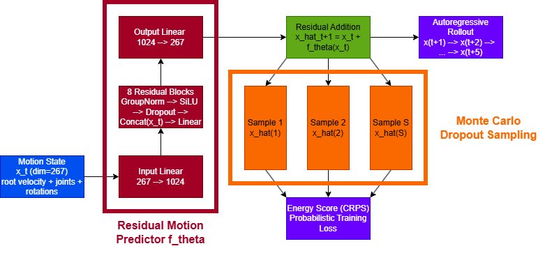
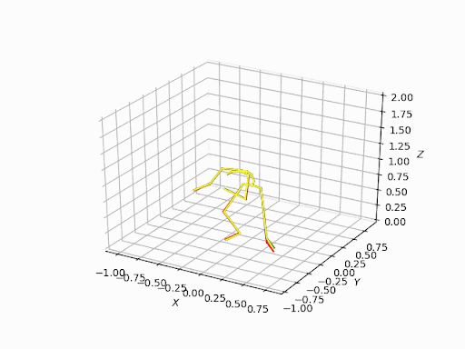

# <p align="center"> Human Motion Trajectory Prediction With Simple Generation </p>
### <p align="center"> [Kabir Vats](https://github.com/kabir-vats), [Livia Chandra](https://github.com/clv07), [Mack Markham](https://github.com/mackmar)
 </p>

## Implementation of Deterministic Motion Model Fine-Tuned with Monto Carlo dropout 

We explore human motion prediction by building upon [Advanced Motion Diffusion Model (AMDM)](https://github.com/Yi-Shi94/AMDM) and introducing a lightweight probabilistic training strategy designed for accurate, diverse, and stable long-horizon motion generation. Our approaches include:

- Continuous Ranked Probability Score (CRPS)
- Monte Carlo Dropout
- Single-step autoregressive prediction

Our contribution shows that probabilistic fine-tuning improves both accuracy and diversity without modifying the original model architecture.

### Model Architecture
<p align="center">
  
</p>


<!-- ## Checkpoints (NEED THIS??)
Download, unzip and merge with your output directory.

[LAFAN1_15step](https://drive.google.com/file/d/1a3emD8C5hN4wbTuPYhI0WytSMCuGoLNs/view?usp=sharing)
 -->
 
## Installation
```
conda create -n lafan_env python=3.7 numpy=1.17
conda init
conda activate lafan_env
git clone https://github.com/clv07/285
cd AMDM
pip install -U pip setuptools wheel
sudo apt-get update
sudo apt-get install -y rustc cargo
pip install -U safetensors
pip install -U transformers
pip install -r requirements.txt
```

## Dataset Preparation
For each dataset, our dataloader automatically parses it into a sequence of 1D frames, saving the frames as data.npz and the essential normalization statistics as stats.npz within your dataset directory. We provide stats.npz so users can perform inference without needing to download the full dataset and provide a single file from the dataset instead.

### LAFAN1:
[Download](https://github.com/ubisoft/ubisoft-laforge-animation-dataset) and extract under ```./data/LAFAN1``` directory.
BEWARE: We didn't include files with a prefix of 'obstacle' in our experiments. 

```
unzip lafan1.zip -d ./data/LAFAN1
cd ./data/LAFAN1
rm -rf obstacles*
cd ../..
export MASTER_ADDR=127.0.0.1
export MASTER_PORT=29500
```


### Arbitrary BVH dataset:
Download and extract under ```./data/``` directory. Create a yaml config file in ```./config/model/```, 


## Base Model
### Training

```
python run_base.py 
--model_config config/model/rollout.yaml 
--log_file output/base/dropout_lafan1/log.txt 
--int_output_dir output/base/eval_dropout_lafan1_crps/ 
--out_model_file output/base/285/output/base/dropout_lafan1_crps_new/model_param.pth 

--mode train 
--master_port 29500 
--rand_seed 122 
```
Training time visualization is saved in --int_output_dir

### Evaluation
```
python run_base.py 
--model_config config/model/rollout.yaml 
--log_file output/base/dropout_lafan1/log.txt 
--int_output_dir output/base/eval_dropout_lafan1_crps/ 
--out_model_file output/base/285/output/base/dropout_lafan1_crps_new/model_param.pth 

--mode eval 
--master_port 29500 
--rand_seed 122 
--model_path output/base/dropout_lafan1_crps/model_param.pth
```


### Inference
```

```

### Sample Generated Motion
<p align="center">
  
</p>

<p align="center">
  
</p>


